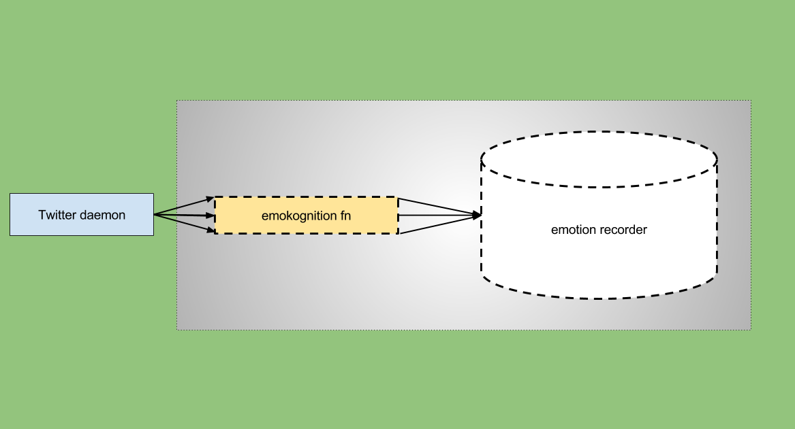
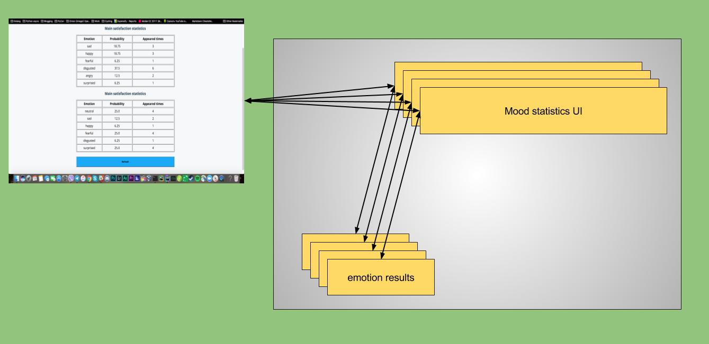

Emotion recognition app
=======================

Emotion recognition app is a distributed highly scalable serverless compute vision app that discovers mood of an audience with respect to their tweets with embedded images.

Architecture
------------

This app consists of following components:

 - [Twitter daemon](twitter-daemon)
 - [Emotion recognition function](emotion-recognition/emokognition)
 - [Emotion recorder](emotion-recognition/emotion-recorder)
 - [Emotion results](emotion-recognition/emotion-results)
 - [Mood statistics UI](emotion-recognition/emokognition-results-view-html)
 - [Persistence layer](https://www.postgresql.org)

Twitter daemon
--------------

Twitter daemon is a highly concurrent tweet dispatcher. It does following:

 - (re)deploys necessary function
 - starts a daemon that polls Twitter for recent mentions for @OnionOmega2 twitter account
 - for each tweet it checks whether it has embedded media
 - for each embedded media it start a recognition function

Twitter daemon supports two kinds of recognition functions:

 - landmark recognition using Google Cloud Vision
 - emotion recognition using TensorFlow with OpenCV

Emotion recognition function
----------------------------

Emotion recognition function aka `emokognition` is a TensorFlow + OpenCV deep neural network prediction application.
It does following:

 - reads an image supplied as URL
 - with help of OpenCV Haar cascade detection finds faces using adaptive algorithm with the assumption that there should be at least one face on the photo
 - for each face on the using TensorFlow deep neural network it predicts 7 emotion probabilities (angry, disgusted, fearful, happy, sad, surprised, neutral)
 - for each sorted probability set it takes highest probabilities as an alternatives to each other
 - sends two alternative emotion to a emotion-recorder function

Written in Python.

Emotion recorder function
-------------------------

Emotion recorder function is a highly concurrent persistence layer entry point for all `emokognition`.
It does following:

 - opens concurrent connection to persistence layer
 - for each incoming request it reads alternative emotions and writes them to persistence layer

Written in Golang.

Mood statistics UI
------------------

Mood statistics UI is a function that calls `emotion results` function to provide set of emotions written by `emotion recorder`.
It does following:

 - calls `emotion results` function for stored emotions
 - for each set of main and alternative emotions it builds a statistics - how often each emotion appeared in data
 - renders HTML templates with respect to main and alternative emotion statistics

Written in Python.

Emotion results
---------------

Emotion results is a function that reads all records from persistence layer
It does following:

 - opens connection to persistence layer
 - reads set of alternative emotions

Written in Python.

Persistence layer
-----------------

App relies on persistence layer PostgreSQL.

Workflow
--------

Each represented function has it's own type - sync or async.
For sync it means whether function runs in attached mode, if i call function i have to await for it's result.
For async it means that function runs in detached mode from caller, you're not getting a result from function, 
but you'll get call identifier that can be used to check execution status some time later.
Previously mentioned functions are deployed with following types:

 - `emokognition`:  async
 - `emotion-recorder`:  async
 - `mood statistics UI`:  sync
 - `emotion results`:  sync

As well as type each function identified with format - default or http.
For default format it means that function gets started only for one call and then dies.
For http format it means that function stays alive while something calls it and dies if there were no calls within certain time frame.
Previously mentioned functions are deployed with following formats:

 - `emokognition`: http
 - `emotion-recorder`:  http
 - `mood statistics UI`:  default
 - `emotion results`:  default

On the following figure you can see how emotion recognition works:



For each new tweet daemon starts new sync emotion recognition function, each emotion recognition function calls emotion recorder function to make a record of its results. 

On the following figure below you can see how mood UI works:



Twitter daemon ---> emokognition ---> emotion-recorder; mood statistics UI <-- emotion results

Configuration
-------------

In order to make all this app work it is necessary to configure properly twitter daemon with following environment vars:

 - `API_URL`: stands for remote deployment
 - `TwitterBotType`: stands for type of recognition (`emokognition` or `landmark`)
 - `TWITTER_APPLICATION_CREDENTIALS`: JSON file with corresponding Twitter credentials to get an access to [Twitter API](https://dev.twitter.com/rest/public),
    it should look like:
    ```json
       {
         "consumer_key": "...",
         "consumer_secret": "...",
         "api_key": "...",
         "api_key_secret": "..."
       }
    ```
 - `POSTGRES_APPLICATION_CONFIG`: JSON file with corresponding PostgreSQL credentials to get an access to remote PostgreSQL database,
   it should look like:
   ```json
      {
        "pg_host": "10.0.2.15",
        "pg_port": "5432",
        "pg_db": "emokognition",
        "pg_user": "postgres",
        "pg_pswd": "postgres"
      }
   ```
 - `InitialTweetID`: tweet ID to start from, this one is very important because we don't want to start processing tweet from the very beginning
    as well as processing those tweets that were already processed before.

Deployment
----------

In order to start one use following command:
```bash
docker run --name postgres -p 5432:5432 -e POSTGRES_PASSWORD=postgres -e POSTGRES_DB=emokognition -e POSTGRES_USER=postgres -d postgres
```

TODOs
-----

 - write emotion-results in Go
 - write emokognition-results-view in Go
